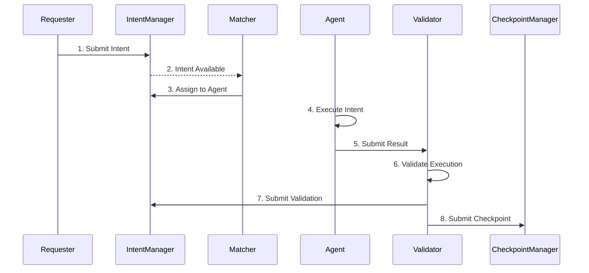

# Roles and Workflows

**[中文文档](roles-and-workflows-zh.md)** | English

This guide explains the different participant roles in the PIN Intent Protocol and their integration workflows.

## Protocol Overview

The PIN Intent Protocol involves multiple participants working together to fulfill user intents:



## Participant Roles

### 1. Requester (Intent Submitter)

**Role**: End users or applications that submit intents for execution.

**Responsibilities**:
- Define intent parameters (type, requirements, payment)
- Deposit payment (ETH or ERC20)
- Monitor intent status
- Claim results or refunds

**Key Operations**:
- Submit intents
- Query intent status
- Handle expired intents
- Process refunds

### 2. Matcher

**Role**: Match available intents with capable agents.

**Responsibilities**:
- Monitor new intents
- Evaluate agent capabilities
- Assign intents to suitable agents
- Manage bidding process (if applicable)

**Key Operations**:
- Query available intents
- Assign intents to agents
- Update assignment status

### 3. Agent

**Role**: Execute intents off-chain and produce results.

**Responsibilities**:
- Accept assigned intents
- Execute intent logic (API calls, computations, etc.)
- Generate execution proofs
- Submit results for validation

**Key Operations**:
- Register as agent in subnet
- Monitor assignments
- Execute intent logic
- Submit results

### 4. Validator

**Role**: Verify agent execution results and maintain network integrity.

**Responsibilities**:
- Validate execution results
- Verify execution proofs
- Sign validation attestations
- Participate in checkpoints

**Key Operations**:
- Register as validator in subnet
- Validate intent executions
- Submit validation signatures
- Participate in checkpoint consensus

### 5. Subnet Owner

**Role**: Create and manage subnets with specific configurations.

**Responsibilities**:
- Configure subnet parameters
- Manage participant approvals
- Set staking requirements
- Control subnet lifecycle

**Key Operations**:
- Create subnets
- Approve/reject participants
- Update configurations
- Pause/resume/deprecate subnets

## Workflow: Requester (Submit Intent)

### Basic Intent Submission

```go
package main

import (
    "context"
    "log"
    "math/big"
    "os"
    "time"

    sdk "github.com/PIN-AI/intent-protocol-contract-sdk/sdk"
    "github.com/ethereum/go-ethereum/common"
)

func submitIntent() error {
    ctx := context.Background()

    // Initialize client
    client, err := sdk.NewClient(ctx, sdk.Config{
        RPCURL:        os.Getenv("PIN_RPC_URL"),
        PrivateKeyHex: os.Getenv("PIN_PRIVATE_KEY"),
    })
    if err != nil {
        return err
    }
    defer client.Close()

    // Generate unique intent ID
    intentID := sdk.GenerateIntentID()

    // Submit intent with ETH payment
    params := sdk.SubmitIntentParams{
        IntentID:   intentID,
        SubnetID:   sdk.MustBytes32FromHex(os.Getenv("SUBNET_ID")),
        IntentType: "weather_query",
        ParamsHash: sdk.HashBytes([]byte(`{"location":"Tokyo","date":"2025-01-20"}`)),
        Deadline:   big.NewInt(time.Now().Add(1 * time.Hour).Unix()),

        // ETH payment
        PaymentToken: common.Address{},
        Amount:       big.NewInt(1e15), // 0.001 ETH
        Value:        big.NewInt(1e15),
    }

    tx, err := client.Intent.SubmitIntent(ctx, params)
    if err != nil {
        return err
    }

    log.Printf("Intent submitted: %s", tx.Hash().Hex())
    log.Printf("Intent ID: %x", intentID)

    return nil
}
```

### Monitor Intent Status

```go
func monitorIntent(client *sdk.Client, intentID [32]byte) error {
    ctx := context.Background()

    // Check if intent exists
    exists, err := client.Intent.IntentExists(ctx, intentID)
    if err != nil {
        return err
    }

    if !exists {
        log.Printf("Intent does not exist")
        return nil
    }

    // Get intent details
    intent, err := client.Intent.GetIntent(ctx, intentID)
    if err != nil {
        return err
    }

    log.Printf("Intent Status: %d", intent.Status)
    log.Printf("Requester: %s", intent.Requester.Hex())
    log.Printf("Amount: %s", intent.Amount.String())
    log.Printf("Deadline: %s", time.Unix(intent.Deadline.Int64(), 0))

    // Check if expired
    isExpired, err := client.Intent.IsIntentExpired(ctx, intentID)
    if err != nil {
        return err
    }

    if isExpired {
        log.Printf("Intent has expired, requesting refund...")
        // Handle expired intent
    }

    return nil
}
```

## Workflow: Matcher (Assign Intents)

### Monitor and Assign

```go
func matcherWorkflow() error {
    ctx := context.Background()

    client, err := sdk.NewClient(ctx, sdk.Config{
        RPCURL:        os.Getenv("PIN_RPC_URL"),
        PrivateKeyHex: os.Getenv("PIN_PRIVATE_KEY"),
    })
    if err != nil {
        return err
    }
    defer client.Close()

    // Matcher must be registered first
    // (See registration section below)

    // Monitor for new intents (polling example)
    ticker := time.NewTicker(10 * time.Second)
    defer ticker.Stop()

    for range ticker.C {
        // Get active intents from subnet
        // (Implementation depends on indexing/event monitoring)

        // Example: Assign specific intent to agent
        intentID := sdk.MustBytes32FromHex(os.Getenv("INTENT_ID"))
        agentAddr := common.HexToAddress(os.Getenv("AGENT_ADDRESS"))

        err := assignIntent(client, intentID, agentAddr)
        if err != nil {
            log.Printf("Assignment failed: %v", err)
            continue
        }

        log.Printf("Intent assigned successfully")
    }

    return nil
}

func assignIntent(client *sdk.Client, intentID [32]byte, agentAddr common.Address) error {
    ctx := context.Background()

    // Generate assignment ID and bid ID
    assignmentID := sdk.GenerateAssignmentID()
    bidID := sdk.GenerateBidID()

    // Create assignment
    assignment := sdk.AssignmentData{
        AssignmentID: assignmentID,
        IntentID:     intentID,
        BidID:        bidID,
        Agent:        agentAddr,
        Status:       sdk.AssignmentStatusActive,
        Matcher:      client.Signer.Address(),
    }

    // Sign assignment
    digest, err := client.Assignment.ComputeDigest(assignment)
    if err != nil {
        return err
    }

    signature, err := client.Assignment.SignDigest(digest)
    if err != nil {
        return err
    }

    // Submit assignment
    tx, err := client.Assignment.AssignIntentsBySignatures(ctx, []sdk.SignedAssignment{
        {Data: assignment, Signature: signature},
    })
    if err != nil {
        return err
    }

    log.Printf("Assignment transaction: %s", tx.Hash().Hex())
    return nil
}
```

## Workflow: Agent (Execute Intents)

### Registration and Execution

```go
func agentWorkflow() error {
    ctx := context.Background()

    client, err := sdk.NewClient(ctx, sdk.Config{
        RPCURL:        os.Getenv("PIN_RPC_URL"),
        PrivateKeyHex: os.Getenv("PIN_PRIVATE_KEY"),
    })
    if err != nil {
        return err
    }
    defer client.Close()

    // 1. Register as agent
    subnetID := sdk.MustBytes32FromHex(os.Getenv("SUBNET_ID"))
    err = registerAsAgent(client, subnetID)
    if err != nil {
        return err
    }

    // 2. Monitor for assignments
    // (Implementation depends on event monitoring)

    // 3. Execute assigned intent
    intentID := sdk.MustBytes32FromHex(os.Getenv("INTENT_ID"))
    assignmentID := sdk.MustBytes32FromHex(os.Getenv("ASSIGNMENT_ID"))

    result, proof, err := executeIntent(intentID)
    if err != nil {
        return err
    }

    // 4. Submit result for validation
    // (Typically done by validator, agent provides result off-chain)
    log.Printf("Intent executed successfully")
    log.Printf("Result: %s", result)
    log.Printf("Proof: %s", proof)

    return nil
}

func registerAsAgent(client *sdk.Client, subnetID [32]byte) error {
    ctx := context.Background()

    subnetSvc, err := client.SubnetServiceByID(ctx, subnetID)
    if err != nil {
        return err
    }

    tx, err := subnetSvc.RegisterAgent(ctx, sdk.RegisterParticipantParams{
        Domain:      "agent.example.com",
        Endpoint:    "https://agent.example.com/api",
        MetadataURI: "ipfs://QmAgent123...",
        Value:       big.NewInt(1e17), // 0.1 ETH stake
    })
    if err != nil {
        return err
    }

    log.Printf("Agent registration: %s", tx.Hash().Hex())
    return nil
}

func executeIntent(intentID [32]byte) (result, proof string, err error) {
    // Agent-specific execution logic
    // This is off-chain and depends on intent type

    // Example: Weather query
    result = `{"temperature": 15, "condition": "sunny"}`
    proof = `{"source": "api.weather.com", "timestamp": 1735689600}`

    return result, proof, nil
}
```

## Workflow: Validator (Validate Executions)

### Registration and Validation

```go
func validatorWorkflow() error {
    ctx := context.Background()

    client, err := sdk.NewClient(ctx, sdk.Config{
        RPCURL:        os.Getenv("PIN_RPC_URL"),
        PrivateKeyHex: os.Getenv("PIN_PRIVATE_KEY"),
    })
    if err != nil {
        return err
    }
    defer client.Close()

    // 1. Register as validator
    subnetID := sdk.MustBytes32FromHex(os.Getenv("SUBNET_ID"))
    err = registerAsValidator(client, subnetID)
    if err != nil {
        return err
    }

    // 2. Monitor for validation requests
    // (Implementation depends on event monitoring)

    // 3. Validate intent execution
    intentID := sdk.MustBytes32FromHex(os.Getenv("INTENT_ID"))
    assignmentID := sdk.MustBytes32FromHex(os.Getenv("ASSIGNMENT_ID"))
    agentAddr := common.HexToAddress(os.Getenv("AGENT_ADDRESS"))

    err = validateIntent(client, subnetID, intentID, assignmentID, agentAddr)
    if err != nil {
        return err
    }

    return nil
}

func registerAsValidator(client *sdk.Client, subnetID [32]byte) error {
    ctx := context.Background()

    subnetSvc, err := client.SubnetServiceByID(ctx, subnetID)
    if err != nil {
        return err
    }

    tx, err := subnetSvc.RegisterValidator(ctx, sdk.RegisterParticipantParams{
        Domain:      "validator.example.com",
        Endpoint:    "https://validator.example.com/api",
        MetadataURI: "ipfs://QmValidator123...",
        Value:       big.NewInt(5e17), // 0.5 ETH stake
    })
    if err != nil {
        return err
    }

    log.Printf("Validator registration: %s", tx.Hash().Hex())
    return nil
}

func validateIntent(
    client *sdk.Client,
    subnetID, intentID, assignmentID [32]byte,
    agentAddr common.Address,
) error {
    ctx := context.Background()

    // 1. Fetch and verify execution result
    // (Off-chain: get result from agent)
    resultHash := sdk.HashBytes([]byte("execution_result"))
    proofHash := sdk.HashBytes([]byte("execution_proof"))

    // 2. Create validation bundle
    bundle := sdk.ValidationBundle{
        IntentID:     intentID,
        AssignmentID: assignmentID,
        SubnetID:     subnetID,
        Agent:        agentAddr,
        ResultHash:   resultHash,
        ProofHash:    proofHash,
        RootHeight:   big.NewInt(1000),
        RootHash:     sdk.HashBytes([]byte("state_root")),
        Validators:   []common.Address{client.Signer.Address()},
    }

    // 3. Sign validation
    digest, err := client.Validation.ComputeDigest(bundle)
    if err != nil {
        return err
    }

    signature, err := client.Validation.SignDigest(digest)
    if err != nil {
        return err
    }

    bundle.Signatures = [][]byte{signature}

    // 4. Submit validation
    tx, err := client.Validation.ValidateIntentsBySignatures(ctx, []sdk.ValidationBundle{bundle})
    if err != nil {
        return err
    }

    log.Printf("Validation submitted: %s", tx.Hash().Hex())
    return nil
}
```

## Workflow: Subnet Owner (Manage Subnet)

### Create and Configure Subnet

```go
func createSubnet() error {
    ctx := context.Background()

    client, err := sdk.NewClient(ctx, sdk.Config{
        RPCURL:        os.Getenv("PIN_RPC_URL"),
        PrivateKeyHex: os.Getenv("PIN_PRIVATE_KEY"),
    })
    if err != nil {
        return err
    }
    defer client.Close()

    // Create subnet with staking requirements
    params := sdk.CreateSubnetParams{
        Name:        "Weather Service Subnet",
        Description: "Subnet for weather data queries",

        // Staking configuration
        MinStakeValidator: big.NewInt(5e17),  // 0.5 ETH
        MinStakeAgent:     big.NewInt(1e17),  // 0.1 ETH
        MinStakeMatcher:   big.NewInt(1e17),  // 0.1 ETH

        // Governance
        AutoApprove: false, // Manual approval required

        // Initial stake (subnet owner)
        Value: big.NewInt(1e18), // 1 ETH
    }

    tx, err := client.SubnetFactory.CreateSubnet(ctx, params)
    if err != nil {
        return err
    }

    log.Printf("Subnet created: %s", tx.Hash().Hex())

    // Extract subnet ID from event logs (pseudo-code)
    // subnetID := extractSubnetIDFromReceipt(receipt)

    return nil
}

func approveParticipant(client *sdk.Client, subnetID [32]byte, participant common.Address) error {
    ctx := context.Background()

    subnetSvc, err := client.SubnetServiceByID(ctx, subnetID)
    if err != nil {
        return err
    }

    // Approve validator/agent/matcher
    tx, err := subnetSvc.ApproveParticipant(ctx, participant, sdk.ParticipantValidator)
    if err != nil {
        return err
    }

    log.Printf("Participant approved: %s", tx.Hash().Hex())
    return nil
}
```

## Integration Patterns

### Event Monitoring

For production systems, use event monitoring instead of polling:

```go
// Example: Monitor Intent submission events
func monitorIntentEvents(client *sdk.Client) error {
    // Subscribe to IntentSubmitted events
    query := ethereum.FilterQuery{
        Addresses: []common.Address{client.Addresses.IntentManager},
        Topics: [][]common.Hash{
            {crypto.Keccak256Hash([]byte("IntentSubmitted(bytes32,address,bytes32)"))},
        },
    }

    logs := make(chan types.Log)
    sub, err := client.Backend.SubscribeFilterLogs(context.Background(), query, logs)
    if err != nil {
        return err
    }
    defer sub.Unsubscribe()

    for {
        select {
        case err := <-sub.Err():
            return err
        case log := <-logs:
            // Process new intent
            intentID := [32]byte(log.Topics[1])
            log.Printf("New intent detected: %x", intentID)
        }
    }
}
```

### Multi-Role Integration

Some participants may operate in multiple roles:

```go
func multiRoleSetup() error {
    client, err := sdk.NewClient(ctx, sdk.Config{
        RPCURL:        os.Getenv("PIN_RPC_URL"),
        PrivateKeyHex: os.Getenv("PIN_PRIVATE_KEY"),
    })
    if err != nil {
        return err
    }

    subnetID := sdk.MustBytes32FromHex(os.Getenv("SUBNET_ID"))
    subnetSvc, err := client.SubnetServiceByID(ctx, subnetID)
    if err != nil {
        return err
    }

    // Register as both Agent and Validator
    // (Requires sufficient stake for both roles)

    _, err = subnetSvc.RegisterAgent(ctx, sdk.RegisterParticipantParams{
        Domain:      "node.example.com",
        Endpoint:    "https://node.example.com/agent",
        MetadataURI: "ipfs://QmAgent...",
        Value:       big.NewInt(1e17),
    })

    _, err = subnetSvc.RegisterValidator(ctx, sdk.RegisterParticipantParams{
        Domain:      "node.example.com",
        Endpoint:    "https://node.example.com/validator",
        MetadataURI: "ipfs://QmValidator...",
        Value:       big.NewInt(5e17),
    })

    return nil
}
```

## Best Practices by Role

### Requester
- Set reasonable deadlines (consider network latency)
- Monitor intent status regularly
- Handle expirations and refunds gracefully
- Use batch submission for multiple intents

### Matcher
- Implement robust agent selection logic
- Monitor agent performance and reputation
- Handle assignment failures gracefully
- Consider bidding mechanisms for optimization

### Agent
- Maintain high availability
- Provide execution proofs
- Monitor assigned intents promptly
- Maintain sufficient stake

### Validator
- Verify results thoroughly
- Maintain synchronized state
- Participate in checkpoints regularly
- Monitor validator set changes

### Subnet Owner
- Set appropriate staking requirements
- Review participant applications carefully
- Monitor subnet health
- Update configurations as needed

## Related Documentation

- [Quick Start](quickstart.md) - Code examples for each role
- [API Reference](api-reference.md) - Complete method documentation
- [Best Practices](best-practices.md) - Production recommendations
- [Troubleshooting](troubleshooting.md) - Common issues and solutions
