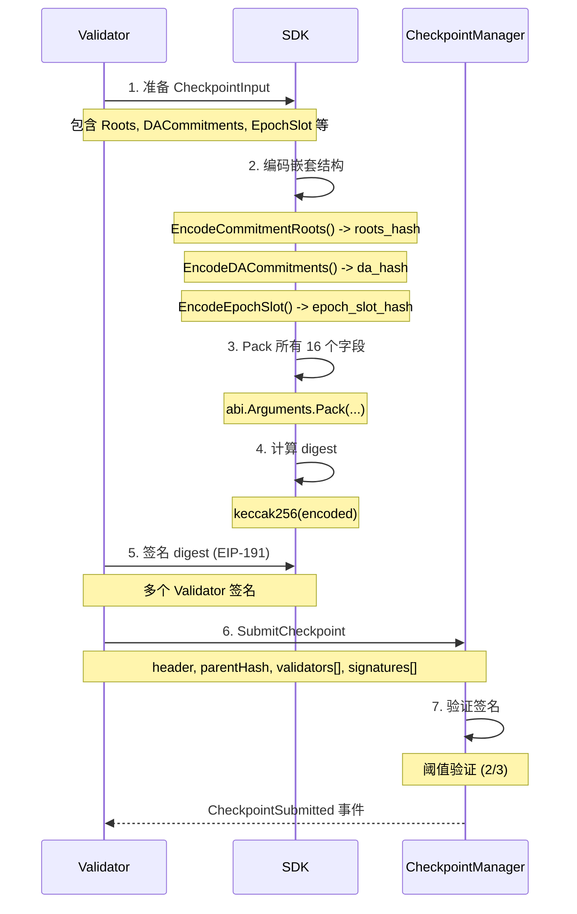

# Checkpoint 签名实现分析

## 问题概述

当前 CheckpointService 只实现了只读方法，缺少关键的 `SubmitCheckpoint` 功能。Checkpoint 签名是 4 种签名中最复杂的，需要处理多层嵌套结构。

---

## 合约签名方案（来自 signature-guide.md）

### TypeHash 定义

```solidity
keccak256("PIN_CHECKPOINT_V1(bytes32,uint64,bytes32,uint256,uint32,bytes32,bytes32,bytes32,bytes32,bytes,bytes32,bytes32,bytes32,bytes32,address,uint256)")
```

### Digest 计算

```solidity
digest = keccak256(abi.encode(
    typeHash,               // 1. bytes32: PIN_CHECKPOINT_V1 type hash
    subnet_id,              // 2. bytes32: 子网 ID
    epoch,                  // 3. uint64: 纪元号
    parent_cp_hash,         // 4. bytes32: 父检查点哈希
    timestamp,              // 5. uint256: Unix 时间戳
    version,                // 6. uint32: 版本号
    params_hash,            // 7. bytes32: 参数哈希
    roots_hash,             // 8. bytes32: keccak256(abi.encode(CommitmentRoots))
    da_hash,                // 9. bytes32: keccak256(abi.encode(DACommitment[]))
    epoch_slot_hash,        // 10. bytes32: keccak256(abi.encode(EpochSlot))
    keccak256(stats),       // 11. bytes32: 统计数据哈希
    aux_hash,               // 12. bytes32: 辅助哈希
    assignments_root,       // 13. bytes32: Intent 分配根
    validation_commitment,  // 14. bytes32: 验证承诺
    policy_root,            // 15. bytes32: 策略根
    contract_address,       // 16. address: CheckpointManager 合约地址
    chain_id                // 17. uint256: 链 ID
))
```

---

## 嵌套结构处理

### 1. CommitmentRoots（8 个根哈希）

```go
type CommitmentRoots struct {
    AgentRoot        [32]byte  // Agent Merkle 根
    AgentServiceRoot [32]byte  // Agent Service 根
    RankRoot         [32]byte  // 排名根
    MetricsRoot      [32]byte  // 指标根
    DataUsageRoot    [32]byte  // 数据使用根
    StateRoot        [32]byte  // 状态根
    EventRoot        [32]byte  // 事件根
    CrossSubnetRoot  [32]byte  // 跨子网根
}

// 编码方式：简单拼接（8 * 32 = 256 bytes）
func EncodeCommitmentRoots(roots CommitmentRoots) []byte {
    encoded := make([]byte, 0, 256)
    encoded = append(encoded, roots.AgentRoot[:]...)
    encoded = append(encoded, roots.AgentServiceRoot[:]...)
    encoded = append(encoded, roots.RankRoot[:]...)
    encoded = append(encoded, roots.MetricsRoot[:]...)
    encoded = append(encoded, roots.DataUsageRoot[:]...)
    encoded = append(encoded, roots.StateRoot[:]...)
    encoded = append(encoded, roots.EventRoot[:]...)
    encoded = append(encoded, roots.CrossSubnetRoot[:]...)
    return encoded
}

// roots_hash = keccak256(encoded)
```

### 2. DACommitment[]（动态数组）

```go
type DACommitment struct {
    Kind          string      // DA 类型（如 "ipfs", "arweave"）
    Pointer       string      // 数据指针（如 IPFS CID）
    SizeHint      *big.Int    // 数据大小提示
    SegmentHashes [][32]byte  // 分段哈希数组
    Expiry        *big.Int    // 过期时间
}

// 编码方式：使用 abi.Arguments.Pack()
func EncodeDACommitments(commitments []DACommitment) ([]byte, error) {
    daType, _ := abi.NewType("tuple[]", "", []abi.ArgumentMarshaling{
        {Name: "kind", Type: "string"},
        {Name: "pointer", Type: "string"},
        {Name: "size_hint", Type: "uint256"},
        {Name: "segment_hashes", Type: "bytes32[]"},
        {Name: "expiry", Type: "uint256"},
    })

    args := abi.Arguments{{Type: daType}}

    // 转换为 interface{} 数组
    commitmentInterfaces := make([]interface{}, len(commitments))
    for i, c := range commitments {
        commitmentInterfaces[i] = struct {
            Kind          string
            Pointer       string
            SizeHint      *big.Int
            SegmentHashes [][32]byte
            Expiry        *big.Int
        }{c.Kind, c.Pointer, c.SizeHint, c.SegmentHashes, c.Expiry}
    }

    return args.Pack(commitmentInterfaces)
}

// da_hash = keccak256(encoded)
```

### 3. EpochSlot（简单结构）

```go
type EpochSlot struct {
    Epoch uint64  // 纪元号
    Slot  uint64  // 槽位号
}

// 编码方式：左填充到 32 字节后拼接
func EncodeEpochSlot(slot EpochSlot) []byte {
    encoded := make([]byte, 0, 64)
    encoded = append(encoded, common.LeftPadBytes(new(big.Int).SetUint64(slot.Epoch).Bytes(), 32)...)
    encoded = append(encoded, common.LeftPadBytes(new(big.Int).SetUint64(slot.Slot).Bytes(), 32)...)
    return encoded
}

// epoch_slot_hash = keccak256(encoded)
```

---

## 完整签名流程



---

## 合约绑定分析

### 当前绑定（checkpointmanager.go）

```go
// ✅ 已有数据结构
type DataStructuresCheckpointHeader struct {
    SubnetId      [32]byte
    Epoch         uint64
    Timestamp     *big.Int
    Version       uint16
    Roots         DataStructuresCommitmentRoots
    DaCommitments []DataStructuresDACommitment
}

type DataStructuresCommitmentRoots struct {
    AgentRoot       [32]byte
    MinerRoot       [32]byte  // ⚠️ 注意：合约用 MinerRoot，SDK 用 AgentServiceRoot
    RankRoot        [32]byte
    DataUsageRoot   [32]byte
    StateRoot       [32]byte
    EventRoot       [32]byte
    CrossSubnetRoot [32]byte
}

type DataStructuresDACommitment struct {
    Kind          string
    Pointer       string
    SizeHint      *big.Int
    SegmentHashes [][32]byte
    Expiry        *big.Int
}

// ✅ 已有方法
func (c *CheckpointManager) SubmitCheckpoint(
    opts *bind.TransactOpts,
    header DataStructuresCheckpointHeader,
    parentCpHash [32]byte,
    validators []common.Address,
    signatures [][]byte,
) (*types.Transaction, error)

func (c *CheckpointManager) ComputeCheckpointHash(
    opts *bind.CallOpts,
    header DataStructuresCheckpointHeader,
) ([32]byte, error)
```

### 字段映射问题

**⚠️ 重要**：合约和 SDK 的字段名称不一致

| SDK (crypto) | 合约 (checkpointmanager) | 说明 |
|-------------|--------------------------|------|
| AgentServiceRoot | MinerRoot | 同一字段，不同命名 |

转换时需要注意：

```go
func convertRoots(roots crypto.CommitmentRoots) checkpointmanager.DataStructuresCommitmentRoots {
    return checkpointmanager.DataStructuresCommitmentRoots{
        AgentRoot:       roots.AgentRoot,
        MinerRoot:       roots.AgentServiceRoot,  // ⚠️ 字段映射
        RankRoot:        roots.RankRoot,
        DataUsageRoot:   roots.DataUsageRoot,
        StateRoot:       roots.StateRoot,
        EventRoot:       roots.EventRoot,
        CrossSubnetRoot: roots.CrossSubnetRoot,
    }
}
```

---

## CheckpointService 增强实现

### 当前状态

```go
// sdk/checkpoint_service.go
type CheckpointService struct {
    contract *checkpointmanager.CheckpointManager
    backend  bind.ContractBackend
    txMgr    *txmgr.Manager  // ✅ 已预留
}

// ✅ 只读方法
func (s *CheckpointService) GetCheckpoint(...)
func (s *CheckpointService) GetCheckpointProof(...)

// ❌ 缺少写方法
```

### 需要新增的方法

```go
// 1. 提交检查点（核心方法）
func (s *CheckpointService) SubmitCheckpoint(
    ctx context.Context,
    header CheckpointHeader,
    parentCpHash [32]byte,
    validators []common.Address,
    signatures [][]byte,
) (*types.Transaction, error) {
    if s.txMgr == nil {
        return nil, errors.New("checkpoint: txManager not attached")
    }

    contractHeader := checkpointmanager.DataStructuresCheckpointHeader{
        SubnetId:      header.SubnetID,
        Epoch:         header.Epoch,
        Timestamp:     header.Timestamp,
        Version:       header.Version,
        Roots:         convertRoots(header.Roots),
        DaCommitments: convertDACommitments(header.DACommitments),
    }

    return s.txMgr.Send(ctx, func(opts *bind.TransactOpts) (*types.Transaction, error) {
        opts.Context = ctx
        return s.contract.SubmitCheckpoint(opts, contractHeader, parentCpHash, validators, signatures)
    })
}

// 2. 计算检查点 digest（供 Validator 签名）
func (s *CheckpointService) ComputeCheckpointDigest(
    input crypto.CheckpointInput,
    contractAddr common.Address,
    chainID *big.Int,
) ([32]byte, error) {
    return crypto.ComputeCheckpointDigest(input, contractAddr, chainID)
}

// 3. 计算检查点哈希（链上验证）
func (s *CheckpointService) ComputeCheckpointHash(
    ctx context.Context,
    header CheckpointHeader,
) ([32]byte, error) {
    contractHeader := checkpointmanager.DataStructuresCheckpointHeader{
        SubnetId:      header.SubnetID,
        Epoch:         header.Epoch,
        Timestamp:     header.Timestamp,
        Version:       header.Version,
        Roots:         convertRoots(header.Roots),
        DaCommitments: convertDACommitments(header.DACommitments),
    }

    return s.contract.ComputeCheckpointHash(&bind.CallOpts{Context: ctx}, contractHeader)
}
```

---

## 测试要点

### 1. 嵌套结构编码测试

```go
func TestEncodeCommitmentRoots(t *testing.T) {
    roots := crypto.CommitmentRoots{
        AgentRoot:        [32]byte{0x01},
        AgentServiceRoot: [32]byte{0x02},
        // ...
    }

    encoded := crypto.EncodeCommitmentRoots(roots)

    // 验证长度
    assert.Equal(t, 256, len(encoded))

    // 验证哈希
    hash := crypto.Keccak256Hash(encoded)
    assert.NotEqual(t, [32]byte{}, hash)
}

func TestEncodeDACommitments(t *testing.T) {
    commitments := []crypto.DACommitment{
        {
            Kind:          "ipfs",
            Pointer:       "QmTest",
            SizeHint:      big.NewInt(1024),
            SegmentHashes: [][32]byte{{0x01}},
            Expiry:        big.NewInt(1234567890),
        },
    }

    encoded, err := crypto.EncodeDACommitments(commitments)
    require.NoError(t, err)
    require.NotEmpty(t, encoded)
}
```

### 2. Digest 计算测试

```go
func TestComputeCheckpointDigest(t *testing.T) {
    input := crypto.CheckpointInput{
        SubnetID:     [32]byte{0x01},
        Epoch:        12345,
        ParentCpHash: [32]byte{0x02},
        Timestamp:    big.NewInt(time.Now().Unix()),
        Version:      1,
        // ... 其他字段
    }

    digest, err := crypto.ComputeCheckpointDigest(
        input,
        common.HexToAddress("0xCheckpointManager"),
        big.NewInt(84532),
    )

    require.NoError(t, err)
    assert.NotEqual(t, [32]byte{}, digest)
}
```

### 3. 签名验证测试

```go
func TestCheckpointSignatureVerification(t *testing.T) {
    // 1. 计算 digest
    digest, _ := crypto.ComputeCheckpointDigest(input, contract, chainID)

    // 2. 多个 validator 签名
    validators := []common.Address{addr1, addr2}
    signatures := [][]byte{sig1, sig2}

    // 3. 提交到测试网
    tx, err := client.CheckpointManager.SubmitCheckpoint(
        ctx,
        header,
        parentHash,
        validators,
        signatures,
    )

    require.NoError(t, err)
    receipt, _ := bind.WaitMined(ctx, client.Backend, tx)
    require.Equal(t, uint64(1), receipt.Status)
}
```

---

## 实施步骤

### 步骤 1：实现签名工具

- [ ] 创建 `sdk/crypto/checkpoint.go`
- [ ] 实现 `EncodeCommitmentRoots`
- [ ] 实现 `EncodeDACommitments`（使用 abi.Arguments）
- [ ] 实现 `EncodeEpochSlot`
- [ ] 实现 `ComputeCheckpointDigest`

### 步骤 2：增强 CheckpointService

- [ ] 添加 `SubmitCheckpoint` 方法
- [ ] 添加 `ComputeCheckpointDigest` 方法
- [ ] 添加 `ComputeCheckpointHash` 方法
- [ ] 实现字段转换函数（convertRoots, convertDACommitments）

### 步骤 3：编写测试

- [ ] 嵌套结构编码测试
- [ ] Digest 计算测试
- [ ] 签名验证测试（需要多个 validator 私钥）
- [ ] E2E 测试（提交到测试网）

### 步骤 4：文档和示例

- [ ] 编写 `docs/checkpoint-guide.md`
- [ ] 创建 `examples/submit_checkpoint/main.go`
- [ ] 更新 `docs/signing.md` 添加 Checkpoint 签名说明

---

## 常见问题

### Q1: 为什么 Checkpoint 签名这么复杂？

**A**: Checkpoint 包含子网的完整状态快照：

- 8 个 Merkle 根（CommitmentRoots）
- 多个 DA 承诺（数据可用性）
- Epoch 细分信息
- Intent 分配和验证状态

需要对嵌套结构先哈希处理，再打包签名。

### Q2: DACommitment 编码为什么使用 abi.Arguments？

**A**: DACommitment 是动态数组，包含 string 和 bytes32[] 等复杂类型，必须使用 Solidity ABI 编码规则：

- string: 动态类型，需要 offset + length + data
- bytes32[]: 动态数组，需要 offset + length + elements

简单拼接会导致编码错误。

### Q3: 字段映射问题如何解决？

**A**: 合约使用 `MinerRoot`，SDK 使用 `AgentServiceRoot`，转换时需要注意：

```go
contractRoots.MinerRoot = sdkRoots.AgentServiceRoot
```

建议在文档中明确说明这个映射关系。

---

## 参考资料

- 智能合约签名指南：`/Users/pis/workspace/PIN/RootLayer/docs/rootlayer-smart-contract/signature-guide.md`
- CheckpointManager 合约：`/Users/pis/workspace/PIN/RootLayer/contracts/CheckpointManager.sol`
- 当前 CheckpointService：`sdk/checkpoint_service.go`
- 合约绑定：`contracts/checkpointmanager/checkpointmanager.go`
