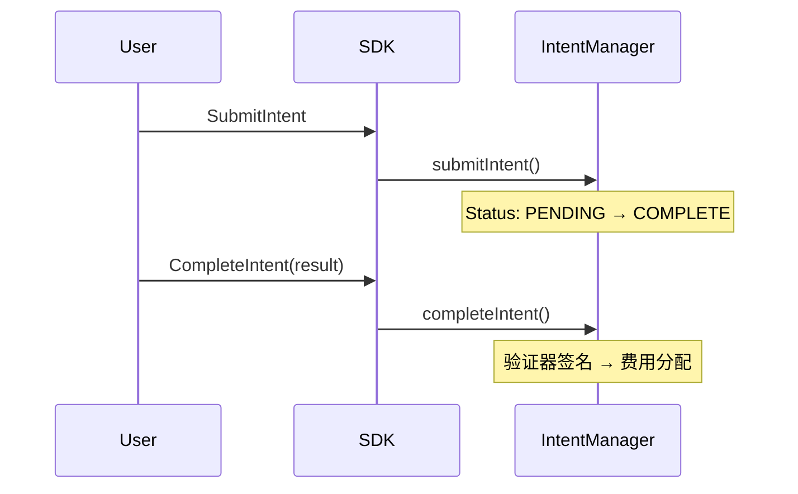
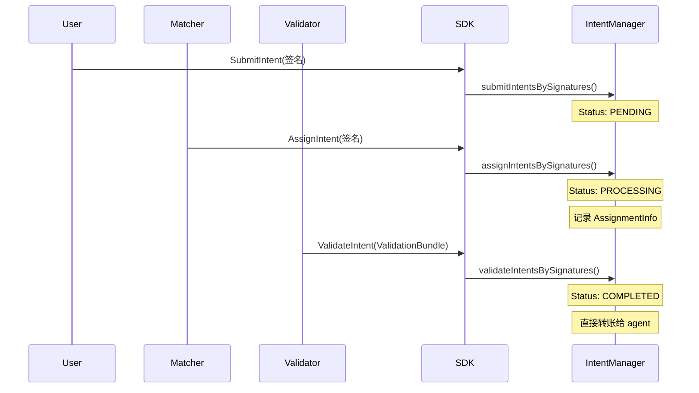
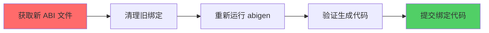
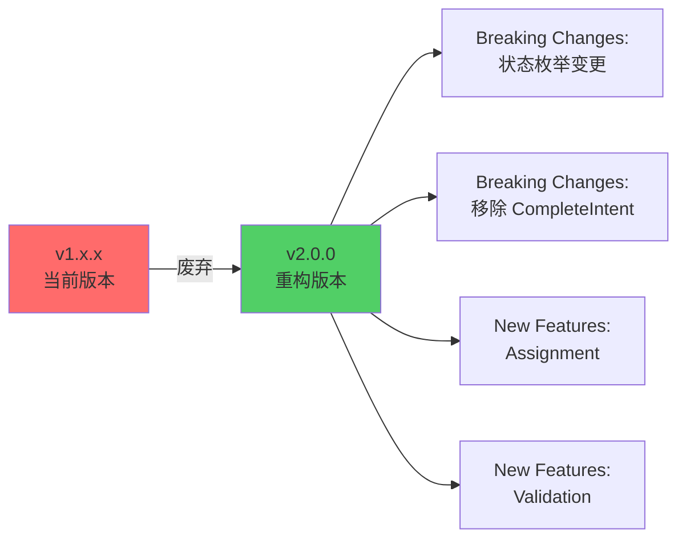
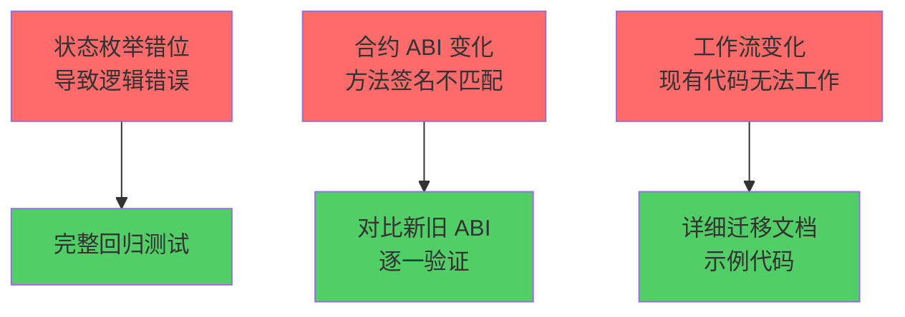

# Intent Protocol Contract SDK 重构方案

## 问题概述

当前 SDK 基于旧版智能合约架构构建，与最新重构的智能合约存在**严重不兼容**。主要问题包括：

1. **状态枚举完全错位**：4 状态 vs 新合约的 5 状态
2. **缺失核心功能**：Assignment 和 Validation 流程完全缺失
3. **签名方案不完整**：只有 Intent 签名，缺少 Assignment 和 Validation 签名
4. **合约绑定过期**：abigen 生成的代码基于旧 ABI
5. **文档过时**：引用已移除的 GOVERNANCE_ROLE 和旧 API

---

## 架构对比分析

### 旧架构（当前 SDK）



**问题**：
- 缺少 Assignment 环节
- 状态机简化（4 状态）
- CompleteIntent 方法已废弃

### 新架构（需要实现）



**核心变化**：
- 5 状态机：PENDING → PROCESSING → COMPLETED/EXPIRED/FAIL
- 必须先 Assign 才能 Validate
- 批量验证替代单次完成
- 直接支付模型（无链上费用分配）

---

## 详细问题分析

### 1. 状态枚举错位（致命）

#### 当前实现 (sdk/intent_service.go:18-26)

```go
type IntentStatus uint8

const (
    IntentStatusPending  IntentStatus = 0
    IntentStatusComplete IntentStatus = 1  // ❌ 错误：应为 PROCESSING
    IntentStatusExpired  IntentStatus = 2  // ❌ 错误：应为 COMPLETED
    IntentStatusFailed   IntentStatus = 3  // ❌ 错误：应为 EXPIRED
    // ❌ 缺少 FAIL (4)
)
```

#### 应该实现（新合约）

```go
type IntentStatus uint8

const (
    IntentStatusPending    IntentStatus = 0
    IntentStatusProcessing IntentStatus = 1  // ✅ 新增：分配后状态
    IntentStatusCompleted  IntentStatus = 2  // ✅ 修正
    IntentStatusExpired    IntentStatus = 3  // ✅ 修正
    IntentStatusFail       IntentStatus = 4  // ✅ 新增
)
```

**影响范围**：
- 所有状态查询逻辑将返回错误结果
- 状态过滤器失效
- 业务逻辑判断错误

---

### 2. 缺失 Assignment 功能

#### 新合约数据结构

```solidity
// contracts/IntentManager.sol
struct AssignmentInfo {
    bytes32 assignment_id;
    bytes32 intent_id;
    bytes32 bid_id;
    address agent;              // ✅ 关键：执行代理地址
    AssignmentStatus status;    // ✅ ACTIVE/FAILED
    address matcher;
    uint256 assigned_at;
}
```

#### SDK 需要新增

```go
// sdk/assignment_service.go (新文件)
type AssignmentStatus uint8

const (
    AssignmentStatusUnspecified AssignmentStatus = 0
    AssignmentStatusActive      AssignmentStatus = 1
    AssignmentStatusFailed      AssignmentStatus = 2
)

type AssignmentInfo struct {
    AssignmentID [32]byte
    IntentID     [32]byte
    BidID        [32]byte
    Agent        common.Address
    Status       AssignmentStatus
    Matcher      common.Address
    AssignedAt   *big.Int
}

type SignedAssignment struct {
    Data      AssignmentData
    Signature []byte
}

type AssignmentService struct {
    backend      bind.ContractBackend
    txManager    *txmgr.Manager
    contract     *intentmanager.IntentManager
    signer       signer.Signer
    chainID      *big.Int
    contractAddr common.Address
}

// 批量提交分配
func (s *AssignmentService) AssignIntentsBySignatures(
    ctx context.Context,
    assignments []SignedAssignment,
) (*types.Transaction, error)

// 计算 Assignment digest
func (s *AssignmentService) ComputeDigest(data AssignmentData) ([32]byte, error)

// 签名 Assignment
func (s *AssignmentService) SignAssignment(data AssignmentData) ([]byte, error)
```

---

### 3. 缺失 Validation 功能

#### 新合约 ValidationBundle

```solidity
// contracts/IntentManager.sol
struct ValidationBundleData {
    bytes32 intent_id;
    bytes32 assignment_id;
    bytes32 subnet_id;
    address agent;              // ✅ address 类型
    bytes32 result_hash;
    bytes32 proof_hash;
    uint64 root_height;
    bytes32 root_hash;
    address[] validators;       // ✅ 直接用 address 数组
    bytes[] signatures;         // ✅ 对应签名数组
}
```

#### SDK 需要新增

```go
// sdk/validation_service.go (新文件)
type ValidationBundle struct {
    IntentID     [32]byte
    AssignmentID [32]byte
    SubnetID     [32]byte
    Agent        common.Address
    ResultHash   [32]byte
    ProofHash    [32]byte
    RootHeight   uint64
    RootHash     [32]byte
    Validators   []common.Address
    Signatures   [][]byte
}

type ValidationService struct {
    backend      bind.ContractBackend
    txManager    *txmgr.Manager
    contract     *intentmanager.IntentManager
    chainID      *big.Int
    contractAddr common.Address
}

// 批量验证
func (s *ValidationService) ValidateIntentsBySignatures(
    ctx context.Context,
    bundles []ValidationBundle,
) (*types.Transaction, error)

// 计算 Validation digest（供 validator 签名）
func ComputeValidationDigest(
    data ValidationData,
    contractAddr common.Address,
    chainID *big.Int,
) ([32]byte, error)
```

---

### 4. 签名方案不完整

#### 当前实现 (sdk/crypto/digest.go)

```go
// ✅ 已有：Intent 签名
var intentTypeHash = crypto.Keccak256Hash([]byte(
    "PIN_INTENT_V1(bytes32,bytes32,address,bytes32,bytes32,uint256,address,uint256,address,uint256)",
))

func ComputeIntentDigest(input SignedIntentInput, contract common.Address, chainID *big.Int) ([32]byte, error) {
    // ... 实现
}
```

#### 需要新增

```go
// sdk/crypto/assignment.go (新文件)
var assignmentTypeHash = crypto.Keccak256Hash([]byte(
    "PIN_ASSIGNMENT_V1(bytes32,bytes32,bytes32,address,uint8,address,address,uint256)",
))

type AssignmentInput struct {
    AssignmentID [32]byte
    IntentID     [32]byte
    BidID        [32]byte
    Agent        common.Address
    Status       uint8
    Matcher      common.Address
}

func ComputeAssignmentDigest(
    input AssignmentInput,
    contract common.Address,
    chainID *big.Int,
) ([32]byte, error) {
    encoded, err := assignmentDigestArgs.Pack(
        assignmentTypeHash,
        input.AssignmentID,
        input.IntentID,
        input.BidID,
        input.Agent,
        input.Status,
        input.Matcher,
        contract,
        chainID,
    )
    if err != nil {
        return [32]byte{}, err
    }
    return crypto.Keccak256Hash(encoded), nil
}

// sdk/crypto/validation.go (新文件)
var validationTypeHash = crypto.Keccak256Hash([]byte(
    "PIN_VALIDATION_V1(bytes32,bytes32,bytes32,address,bytes32,bytes32,uint64,bytes32,address,uint256)",
))

type ValidationInput struct {
    IntentID     [32]byte
    AssignmentID [32]byte
    SubnetID     [32]byte
    Agent        common.Address
    ResultHash   [32]byte
    ProofHash    [32]byte
    RootHeight   uint64
    RootHash     [32]byte
}

func ComputeValidationDigest(
    input ValidationInput,
    contract common.Address,
    chainID *big.Int,
) ([32]byte, error) {
    encoded, err := validationDigestArgs.Pack(
        validationTypeHash,
        input.IntentID,
        input.AssignmentID,
        input.SubnetID,
        input.Agent,
        input.ResultHash,
        input.ProofHash,
        input.RootHeight,
        input.RootHash,
        contract,
        chainID,
    )
    if err != nil {
        return [32]byte{}, err
    }
    return crypto.Keccak256Hash(encoded), nil
}
```

---

### 5. 合约绑定过期

#### 当前绑定缺少的方法

```go
// contracts/intentmanager/intentmanager.go 缺少：

// ❌ 缺少 assignIntentsBySignatures
func (c *IntentManager) AssignIntentsBySignatures(
    opts *bind.TransactOpts,
    assignments []IIntentManagerAssignmentData,
    signatures [][]byte,
) (*types.Transaction, error)

// ❌ 缺少 validateIntentsBySignatures
func (c *IntentManager) ValidateIntentsBySignatures(
    opts *bind.TransactOpts,
    validations []IIntentManagerValidationBundleData,
) (*types.Transaction, error)

// ❌ 缺少 getAssignmentInfo
func (c *IntentManager) GetAssignmentInfo(
    opts *bind.CallOpts,
    assignmentID [32]byte,
) (IDataStructuresAssignmentInfo, error)
```

---

## 重构实施计划

### 阶段 1：重新生成合约绑定（最优先）



**执行步骤**：

```bash
# 1. 从 RootLayer 项目获取最新 ABI
cd /Users/pis/workspace/PIN/RootLayer
pnpm compile

# 2. 提取 ABI
jq -r '.abi' artifacts/contracts/IntentManager.sol/IntentManager.json \
  > /tmp/IntentManager.abi

# 3. 重新生成绑定
cd /Users/pis/workspace/PIN/intent-protocol-contract-sdk
abigen --abi /tmp/IntentManager.abi \
       --pkg intentmanager \
       --type IntentManager \
       --out contracts/intentmanager/intentmanager.go

# 4. 同样处理其他合约
for name in SubnetFactory Subnet StakingManager CheckpointManager; do
  jq -r '.abi' /Users/pis/workspace/PIN/RootLayer/artifacts/contracts/${name}.sol/${name}.json \
    > /tmp/${name}.abi
  pkg=$(echo "$name" | tr '[:upper:]' '[:lower:]')
  abigen --abi /tmp/${name}.abi \
         --pkg $pkg \
         --type ${name} \
         --out contracts/$pkg/${pkg}.go
done
```

---

### 阶段 2：修正核心数据结构

**文件修改清单**：

| 文件 | 修改内容 | 优先级 |
|------|---------|--------|
| `sdk/intent_service.go` | 修正 IntentStatus 枚举（5个状态） | P0 |
| `sdk/types.go` (新建) | 定义 AssignmentStatus、AssignmentInfo | P0 |
| `sdk/types.go` | 定义 ValidationBundle 相关结构 | P0 |

**实现**：

```go
// sdk/types.go (新文件)
package sdk

import (
    "math/big"
    "github.com/ethereum/go-ethereum/common"
)

// IntentStatus 意图状态（5状态机）
type IntentStatus uint8

const (
    IntentStatusPending    IntentStatus = 0
    IntentStatusProcessing IntentStatus = 1
    IntentStatusCompleted  IntentStatus = 2
    IntentStatusExpired    IntentStatus = 3
    IntentStatusFail       IntentStatus = 4
)

// AssignmentStatus 分配状态
type AssignmentStatus uint8

const (
    AssignmentStatusUnspecified AssignmentStatus = 0
    AssignmentStatusActive      AssignmentStatus = 1
    AssignmentStatusFailed      AssignmentStatus = 2
)

// AssignmentInfo 分配信息
type AssignmentInfo struct {
    AssignmentID [32]byte
    IntentID     [32]byte
    BidID        [32]byte
    Agent        common.Address
    Status       AssignmentStatus
    Matcher      common.Address
    AssignedAt   *big.Int
}

// ValidationBundle 验证包
type ValidationBundle struct {
    IntentID     [32]byte
    AssignmentID [32]byte
    SubnetID     [32]byte
    Agent        common.Address
    ResultHash   [32]byte
    ProofHash    [32]byte
    RootHeight   uint64
    RootHash     [32]byte
    Validators   []common.Address
    Signatures   [][]byte
}
```

---

### 阶段 3：实现签名工具

**新增文件**：

1. `sdk/crypto/assignment.go`
2. `sdk/crypto/validation.go`

**实现要点**：

- 使用 `abi.Arguments.Pack()` 正确编码
- 绑定 `contract address` 和 `chainID` 防重放
- 提供 `ComputeDigest` 和 `Sign` 两层 API

---

### 阶段 4：实现 Service 层

#### 4.1 AssignmentService

```go
// sdk/assignment_service.go (新文件)
package sdk

import (
    "context"
    "math/big"

    "github.com/ethereum/go-ethereum/accounts/abi/bind"
    "github.com/ethereum/go-ethereum/common"
    "github.com/ethereum/go-ethereum/core/types"

    intentmanager "github.com/PIN-AI/intent-protocol-contract-sdk/contracts/intentmanager"
    "github.com/PIN-AI/intent-protocol-contract-sdk/sdk/crypto"
    "github.com/PIN-AI/intent-protocol-contract-sdk/sdk/signer"
    "github.com/PIN-AI/intent-protocol-contract-sdk/sdk/txmgr"
)

type AssignmentData struct {
    AssignmentID [32]byte
    IntentID     [32]byte
    BidID        [32]byte
    Agent        common.Address
    Status       AssignmentStatus
    Matcher      common.Address
}

type SignedAssignment struct {
    Data      AssignmentData
    Signature []byte
}

type AssignmentService struct {
    backend      bind.ContractBackend
    txManager    *txmgr.Manager
    contract     *intentmanager.IntentManager
    signer       signer.Signer
    chainID      *big.Int
    contractAddr common.Address
}

func NewAssignmentService(
    backend bind.ContractBackend,
    txm *txmgr.Manager,
    contract *intentmanager.IntentManager,
    sig signer.Signer,
    chainID *big.Int,
    contractAddr common.Address,
) *AssignmentService {
    return &AssignmentService{
        backend:      backend,
        txManager:    txm,
        contract:     contract,
        signer:       sig,
        chainID:      new(big.Int).Set(chainID),
        contractAddr: contractAddr,
    }
}

// AssignIntentsBySignatures 批量提交分配
func (s *AssignmentService) AssignIntentsBySignatures(
    ctx context.Context,
    assignments []SignedAssignment,
) (*types.Transaction, error) {
    // 转换为合约结构
    contractAssignments := make([]intentmanager.IIntentManagerAssignmentData, len(assignments))
    signatures := make([][]byte, len(assignments))

    for i, a := range assignments {
        contractAssignments[i] = intentmanager.IIntentManagerAssignmentData{
            AssignmentId: a.Data.AssignmentID,
            IntentId:     a.Data.IntentID,
            BidId:        a.Data.BidID,
            Agent:        a.Data.Agent,
            Status:       uint8(a.Data.Status),
            Matcher:      a.Data.Matcher,
        }
        signatures[i] = a.Signature
    }

    return s.txManager.Send(ctx, func(opts *bind.TransactOpts) (*types.Transaction, error) {
        opts.Context = ctx
        return s.contract.AssignIntentsBySignatures(opts, contractAssignments, signatures)
    })
}

// ComputeDigest 计算 Assignment digest
func (s *AssignmentService) ComputeDigest(data AssignmentData) ([32]byte, error) {
    return crypto.ComputeAssignmentDigest(crypto.AssignmentInput{
        AssignmentID: data.AssignmentID,
        IntentID:     data.IntentID,
        BidID:        data.BidID,
        Agent:        data.Agent,
        Status:       uint8(data.Status),
        Matcher:      data.Matcher,
    }, s.contractAddr, s.chainID)
}

// SignDigest 签名 digest
func (s *AssignmentService) SignDigest(digest [32]byte) ([]byte, error) {
    return s.signer.SignDigest(digest)
}

// GetAssignmentInfo 查询分配信息
func (s *AssignmentService) GetAssignmentInfo(
    ctx context.Context,
    assignmentID [32]byte,
) (AssignmentInfo, error) {
    info, err := s.contract.GetAssignmentInfo(&bind.CallOpts{Context: ctx}, assignmentID)
    if err != nil {
        return AssignmentInfo{}, err
    }

    return AssignmentInfo{
        AssignmentID: info.AssignmentId,
        IntentID:     info.IntentId,
        BidID:        info.BidId,
        Agent:        info.Agent,
        Status:       AssignmentStatus(info.Status),
        Matcher:      info.Matcher,
        AssignedAt:   info.AssignedAt,
    }, nil
}
```

#### 4.2 ValidationService

```go
// sdk/validation_service.go (新文件)
package sdk

import (
    "context"
    "math/big"

    "github.com/ethereum/go-ethereum/accounts/abi/bind"
    "github.com/ethereum/go-ethereum/common"
    "github.com/ethereum/go-ethereum/core/types"

    intentmanager "github.com/PIN-AI/intent-protocol-contract-sdk/contracts/intentmanager"
    "github.com/PIN-AI/intent-protocol-contract-sdk/sdk/crypto"
    "github.com/PIN-AI/intent-protocol-contract-sdk/sdk/txmgr"
)

type ValidationService struct {
    backend      bind.ContractBackend
    txManager    *txmgr.Manager
    contract     *intentmanager.IntentManager
    chainID      *big.Int
    contractAddr common.Address
}

func NewValidationService(
    backend bind.ContractBackend,
    txm *txmgr.Manager,
    contract *intentmanager.IntentManager,
    chainID *big.Int,
    contractAddr common.Address,
) *ValidationService {
    return &ValidationService{
        backend:      backend,
        txManager:    txm,
        contract:     contract,
        chainID:      new(big.Int).Set(chainID),
        contractAddr: contractAddr,
    }
}

// ValidateIntentsBySignatures 批量验证
func (s *ValidationService) ValidateIntentsBySignatures(
    ctx context.Context,
    bundles []ValidationBundle,
) (*types.Transaction, error) {
    // 转换为合约结构
    contractBundles := make([]intentmanager.IIntentManagerValidationBundleData, len(bundles))

    for i, b := range bundles {
        contractBundles[i] = intentmanager.IIntentManagerValidationBundleData{
            IntentId:     b.IntentID,
            AssignmentId: b.AssignmentID,
            SubnetId:     b.SubnetID,
            Agent:        b.Agent,
            ResultHash:   b.ResultHash,
            ProofHash:    b.ProofHash,
            RootHeight:   b.RootHeight,
            RootHash:     b.RootHash,
            Validators:   b.Validators,
            Signatures:   b.Signatures,
        }
    }

    return s.txManager.Send(ctx, func(opts *bind.TransactOpts) (*types.Transaction, error) {
        opts.Context = ctx
        return s.contract.ValidateIntentsBySignatures(opts, contractBundles)
    })
}

// ComputeValidationDigest 计算验证 digest（供 validator 签名）
func ComputeValidationDigest(
    intentID, assignmentID, subnetID [32]byte,
    agent common.Address,
    resultHash, proofHash [32]byte,
    rootHeight uint64,
    rootHash [32]byte,
    contractAddr common.Address,
    chainID *big.Int,
) ([32]byte, error) {
    return crypto.ComputeValidationDigest(crypto.ValidationInput{
        IntentID:     intentID,
        AssignmentID: assignmentID,
        SubnetID:     subnetID,
        Agent:        agent,
        ResultHash:   resultHash,
        ProofHash:    proofHash,
        RootHeight:   rootHeight,
        RootHash:     rootHash,
    }, contractAddr, chainID)
}
```

---

### 阶段 5：重构 IntentService

**移除旧 API**：

```go
// ❌ 删除 CompleteIntent
// func (s *IntentService) CompleteIntent(...)

// ❌ 删除 FailIntent
// func (s *IntentService) FailIntent(...)
```

**保留并优化**：

- `SubmitIntent`
- `SubmitIntentsBySignatures`
- `ProcessExpiredIntent`
- `BatchProcessExpiredIntents`
- 所有查询方法

---

### 阶段 6：重构 Client

```go
// sdk/config.go 和 sdk/client.go
type Client struct {
    Backend   *ethclient.Client
    ChainID   *big.Int
    Network   addressbook.Network
    Addresses addressbook.Addresses
    Signer    signer.Signer
    TxManager *txmgr.Manager

    // 核心服务（新架构）
    Intent     *IntentService
    Assignment *AssignmentService  // ✅ 新增
    Validation *ValidationService  // ✅ 新增

    // 基础设施服务
    SubnetFactory     *SubnetFactoryService
    StakingManager    *StakingService
    CheckpointManager *CheckpointService
}

func NewClient(ctx context.Context, cfg Config) (*Client, error) {
    // ... 现有逻辑

    intentContract, _ := intentmanager.NewIntentManager(addresses.IntentManager, backend)

    client := &Client{
        // ... 现有字段

        Intent: NewIntentService(backend, txManager, intentContract, signing, chainID, addresses.IntentManager),

        // ✅ 新增
        Assignment: NewAssignmentService(backend, txManager, intentContract, signing, chainID, addresses.IntentManager),
        Validation: NewValidationService(backend, txManager, intentContract, chainID, addresses.IntentManager),

        // ... 其他服务
    }

    return client, nil
}
```

---

### 阶段 7：更新示例和文档

#### 7.1 新增完整流程示例

```go
// examples/complete_workflow/main.go (新文件)
package main

import (
    "context"
    "log"
    "math/big"
    "time"

    sdk "github.com/PIN-AI/intent-protocol-contract-sdk/sdk"
    "github.com/ethereum/go-ethereum/common"
)

func main() {
    ctx := context.Background()

    // 1. 初始化客户端
    client, _ := sdk.NewClient(ctx, sdk.Config{
        RPCURL:        "https://sepolia.base.org",
        PrivateKeyHex: "0x...",
        Network:       "base_sepolia",
    })
    defer client.Close()

    // 2. 提交 Intent（用户签名）
    intentInput := sdk.SignedIntentInput{
        IntentID:     sdk.MustBytes32FromHex("0x..."),
        SubnetID:     sdk.MustBytes32FromHex("0x..."),
        Requester:    client.Signer.Address(),
        IntentType:   "book_flight",
        ParamsHash:   sdk.HashBytes([]byte(`{"from":"NYC","to":"LAX"}`)),
        Deadline:     big.NewInt(time.Now().Add(24 * time.Hour).Unix()),
        PaymentToken: common.Address{}, // ETH
        Amount:       big.NewInt(1e16),  // 0.01 ETH
    }

    digest, _ := client.Intent.ComputeDigest(intentInput)
    signature, _ := client.Intent.SignDigest(digest)

    tx1, _ := client.Intent.SubmitIntentsBySignatures(ctx, sdk.SubmitIntentBatchParams{
        Items: []sdk.SignedIntent{{Data: intentInput, Signature: signature}},
    })
    log.Printf("Intent submitted: %s", tx1.Hash())

    // 3. Matcher 分配（Matcher 签名）
    assignmentData := sdk.AssignmentData{
        AssignmentID: sdk.MustBytes32FromHex("0x..."),
        IntentID:     intentInput.IntentID,
        BidID:        sdk.MustBytes32FromHex("0x..."),
        Agent:        common.HexToAddress("0xAgentAddress"),
        Status:       sdk.AssignmentStatusActive,
        Matcher:      client.Signer.Address(), // Matcher 是当前签名者
    }

    assignDigest, _ := client.Assignment.ComputeDigest(assignmentData)
    assignSig, _ := client.Assignment.SignDigest(assignDigest)

    tx2, _ := client.Assignment.AssignIntentsBySignatures(ctx, []sdk.SignedAssignment{
        {Data: assignmentData, Signature: assignSig},
    })
    log.Printf("Assignment submitted: %s", tx2.Hash())

    // 4. Validator 验证（多个 Validator 签名）
    validationBundle := sdk.ValidationBundle{
        IntentID:     intentInput.IntentID,
        AssignmentID: assignmentData.AssignmentID,
        SubnetID:     intentInput.SubnetID,
        Agent:        assignmentData.Agent,
        ResultHash:   sdk.MustBytes32FromHex("0xResultHash"),
        ProofHash:    sdk.MustBytes32FromHex("0xProofHash"),
        RootHeight:   12345,
        RootHash:     sdk.MustBytes32FromHex("0xRootHash"),
    }

    // 假设有多个 validator 私钥
    validators := []common.Address{
        common.HexToAddress("0xValidator1"),
        common.HexToAddress("0xValidator2"),
    }

    // 每个 validator 签名
    signatures := make([][]byte, len(validators))
    for i, validatorKey := range validatorPrivateKeys {
        valDigest, _ := sdk.ComputeValidationDigest(
            validationBundle.IntentID,
            validationBundle.AssignmentID,
            validationBundle.SubnetID,
            validationBundle.Agent,
            validationBundle.ResultHash,
            validationBundle.ProofHash,
            validationBundle.RootHeight,
            validationBundle.RootHash,
            client.Addresses.IntentManager,
            client.ChainID,
        )
        signatures[i], _ = signWithKey(valDigest, validatorKey)
    }

    validationBundle.Validators = validators
    validationBundle.Signatures = signatures

    tx3, _ := client.Validation.ValidateIntentsBySignatures(ctx, []sdk.ValidationBundle{validationBundle})
    log.Printf("Validation submitted: %s", tx3.Hash())
}
```

#### 7.2 更新文档

**需要更新的文件**：

- `README.md`：移除旧 API 引用，添加新流程说明
- `docs/quickstart.md`：完整的 3 步流程示例
- `docs/signing.md`：添加 Assignment 和 Validation 签名说明
- `docs/api-migration.md`（新建）：v1 → v2 迁移指南

---

## 迁移策略

### 版本管理



**发布计划**：

1. **v2.0.0-alpha.1**：重新生成绑定 + 修正状态枚举
2. **v2.0.0-alpha.2**：实现 Assignment 功能
3. **v2.0.0-alpha.3**：实现 Validation 功能
4. **v2.0.0-beta.1**：完整集成测试
5. **v2.0.0**：正式发布

### 破坏性变更清单

| 变更 | 影响 | 迁移方式 |
|------|------|---------|
| IntentStatus 枚举值变化 | 所有状态判断代码 | 更新常量引用 |
| 移除 CompleteIntent | 验证器代码 | 使用 ValidateIntentsBySignatures |
| 移除 FailIntent | 验证器代码 | 使用 ValidationBundle (status=FAILED) |
| 新增 Assignment 步骤 | Intent 工作流 | 必须先 Assign 再 Validate |
| Client 结构变化 | 初始化代码 | 更新 Client 字段访问 |

### 迁移检查清单

**开发者需要做的**：

- [ ] 更新 SDK 到 v2.0.0
- [ ] 修改所有 IntentStatus 常量引用
- [ ] 删除 CompleteIntent/FailIntent 调用
- [ ] 实现 Matcher 逻辑（调用 Assignment API）
- [ ] 实现 Validator 逻辑（调用 Validation API）
- [ ] 更新签名流程（3 种签名）
- [ ] 测试完整工作流

---

## 风险评估

### 高风险项



### 测试策略

1. **单元测试**：
   - 每个签名计算函数
   - 每个 Service 的方法调用
   - 数据结构转换

2. **集成测试**：
   - 完整 Intent 生命周期
   - Assignment 流程
   - Validation 流程
   - 异常场景（过期、失败）

3. **E2E 测试**：
   - 真实网络（testnet）部署
   - 多角色协作（User → Matcher → Validator）
   - 性能测试（批量操作）

---

## 实施时间估算

| 阶段 | 任务 | 工作量 | 负责人 |
|------|------|--------|--------|
| 1 | 重新生成合约绑定 | 2h | - |
| 2 | 修正数据结构 | 4h | - |
| 3 | 实现签名工具 | 6h | - |
| 4 | 实现 AssignmentService | 8h | - |
| 4 | 实现 ValidationService | 8h | - |
| 5 | 重构 IntentService | 4h | - |
| 6 | 重构 Client | 4h | - |
| 7 | 更新示例和文档 | 8h | - |
| 测试 | 单元测试 + 集成测试 | 16h | - |
| 测试 | E2E 测试 + 修复 | 8h | - |
| **总计** | - | **68h (~9 工作日)** | - |

---

## 下一步行动

### 立即执行（P0）

1. ✅ 保存此重构方案到 `issue/sdk-refactor-plan.md`
2. 🔴 **确认 RootLayer 合约已部署并获取最新 ABI**
3. 🔴 **重新生成所有合约绑定**
4. 🔴 **修正 IntentStatus 枚举**

### 后续计划（P1）

5. 实现 Assignment 签名工具和 Service
6. 实现 Validation 签名工具和 Service
7. 重构 Client 集成新 Service
8. 编写完整示例和测试

### 文档和发布（P2）

9. 更新所有文档
10. 编写迁移指南
11. 发布 v2.0.0-alpha.1

---

## 附录：关键文件清单

### 需要修改的文件

- `contracts/intentmanager/intentmanager.go` - 重新生成
- `sdk/intent_service.go` - 修正状态枚举
- `sdk/types.go` - 新增（定义核心类型）
- `sdk/assignment_service.go` - 新增
- `sdk/validation_service.go` - 新增
- `sdk/crypto/assignment.go` - 新增
- `sdk/crypto/validation.go` - 新增
- `sdk/config.go` - 更新 Client 结构
- `README.md` - 更新
- `docs/quickstart.md` - 更新
- `docs/signing.md` - 更新

### 需要删除的代码

- `IntentService.CompleteIntent` 方法
- `IntentService.FailIntent` 方法
- 旧版状态枚举定义（4 状态）

### 需要新增的示例

#### Intent 流程
- `examples/complete_workflow/main.go` - Intent 完整流程
- `examples/matcher_assignment/main.go` - Matcher 示例
- `examples/validator_validation/main.go` - Validator 示例

#### Checkpoint 流程
- `examples/submit_checkpoint/main.go` - Checkpoint 提交示例
- `examples/validator_checkpoint/main.go` - Validator 多签示例

---

**重要提醒**：

> 此次重构涉及**破坏性变更**，必须以 v2.0.0 major version 发布。
>
> 所有依赖 v1.x.x 的项目需要完整重构其 Intent 处理逻辑。

---

---

## 签名复杂度对比

```mermaid
graph LR
    subgraph "简单签名"
        I[Intent<br/>10 字段] --> IP[直接编码]
        A[Assignment<br/>8 字段] --> AP[直接编码]
    end

    subgraph "中等签名"
        V[Validation<br/>10 字段] --> VP[直接编码<br/>address[] 处理]
    end

    subgraph "复杂签名"
        C[Checkpoint<br/>16 字段] --> CR[嵌套结构处理]
        CR --> CR1[CommitmentRoots<br/>8 根哈希]
        CR --> CR2[DACommitment[]<br/>动态数组]
        CR --> CR3[EpochSlot<br/>简单结构]
        CR1 & CR2 & CR3 --> CH[哈希计算]
        CH --> CF[最终编码]
    end

    style I fill:#51cf66
    style A fill:#51cf66
    style V fill:#ffd43b
    style C fill:#ff6b6b
```

**实施建议**：

1. **先实现简单签名**（Intent, Assignment）- 2-3 天
2. **再实现中等签名**（Validation）- 2-3 天
3. **最后实现复杂签名**（Checkpoint）- 3-4 天

总计：**7-10 天**完成所有签名工具

---

## 相关文档

- **主重构方案**：`issue/sdk-refactor-plan.md`（本文档）
- **Checkpoint 签名分析**：`issue/checkpoint-signature-analysis.md`
- **智能合约签名指南**：`/Users/pis/workspace/PIN/RootLayer/docs/rootlayer-smart-contract/signature-guide.md`

---

**文档版本**：v1.1
**创建时间**：2025-10-03
**最后更新**：2025-10-03
**作者**：Claude Code
